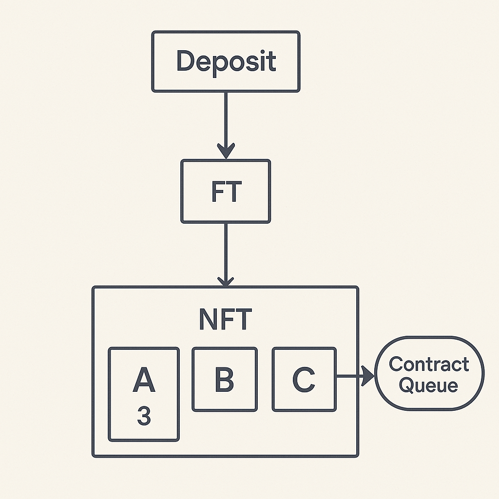
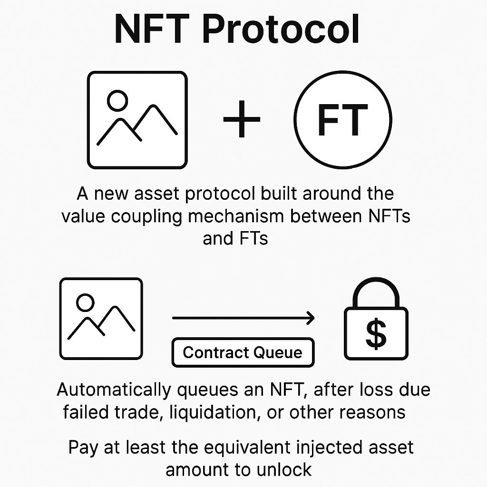

# NFT Protocol

## 项目简介

### Demo视频
<video width="100%" controls>
  <source src="./public/1682_1744603198_raw.mp4" type="video/mp4">
</video>

[点击观看演示视频](https://youtu.be/G36bJMFzPMs?si=XATU1fOCYoDwEymQ)

**NFT Protocol** 是一个围绕 NFT 与 FT 价值耦合机制构建的新型资产协议。用户每拥有 1 单位的同质化代币（FT），协议即自动为其铸造 1 个对应的非同质化代币（NFT）；若因转账或清算等原因使得 FT 总量不足整数单位，则会自动回收 1 个 NFT 并将其放入合约队列。

协议还支持将 FT 精准注入某一特定 NFT，以增强其价值。但若该注入行为导致 NFT 与 FT **的映射关系被破坏**（如注入后剩余 FT 无法再维持其他 NFT 的存在），系统将**自动回收受影响的 NFT**并将其放入合约托管队列。  
例如，若用户拥有 3.3 个 FT 与 3 个 NFT（A、B、C），并向 A 注入 2 个 FT（使 A 的价值变为 3），则剩余 1.3 个 FT 无法再支撑 2 个 NFT，系统将自动收回 B 和 C。****

该机制赋予 NFT 一种"可流动的资产凭证"属性，使其不再只是收藏品，而成为由 FT 支持、可通过市场重新竞得的金融载体。

此外，当 NFT 因交易失败、质押清算或其他原因"丧失"后，它将自动进入托管队列。任何用户若想重新获得该 NFT，必须支付**至少等值的注入资产总量**，以确保公平性与价值一致性。  


这种机制在保障 NFT 稀缺性的同时，也构建了一种独特的"资产占位+竞得式"游戏金融模型，为 DeFi、GameFi 与 RWA 应用场景提供创新基础设施。  


---

## 核心机制

### 🌀 价值注入与绑定
- NFT 可被注入任意种类的 FT（ERC20 等）作为价值载体。
- 所有绑定操作都在链上通过智能合约不可篡改记录。

### 🌀 资产回收与锁仓竞得
- 一旦用户丧失 NFT（如：超时质押、强制回收、死亡合约等），NFT 自动进入系统队列。
- 想要"解锁"该 NFT 的人，必须注入不少于原始注入 FT 总量的资产，从而重新获得其所有权。

### ⚙️ 自动铸造与回收机制
- 每拥有 1 单位 FT，即自动铸造 1 个对应的 NFT。
- 如果因交易或其他操作导致用户的 FT 数量**不再为整数**，协议将**自动回收超出整数份额对应的 NFT**，并将其加入合约托管队列。
- 例如：用户拥有 3.3 个 FT，即拥有 3 个 NFT；若丧失 0.4 个 FT，仅剩 2.9 个 FT，对应的 NFT 数量将自动降为 2 个，释放出的 NFT 将进入队列。

### 💥 结构扰动与回收触发
- 用户可向单个 NFT 手动注入额外 FT，用于增加其价值或用于质押行为。
- 若此注入操作造成**NFT 总量与 FT 支持之间的平衡被打破**，多余 NFT 将立即回收。
- 例如：若用户拥有 3 个 NFT（A、B、C）和 3.3 个 FT，向 A 注入 2 个 FT（使 A 的总值为 3），则剩余的 1.3 个 FT 仅能维持 1 个 NFT，系统将自动将 B 和 C 移入托管队列。

---

## 应用场景

### 1. LP 头寸期权化
将 Uniswap 等 AMM 中的 LP 头寸打包成 NFT，再通过价值注入构建类期权资产，实现做市+投机的双轮驱动。

### 2. 奢侈品 RWA（Real-World Assets）
将现实中的奢侈品（如限量手表、艺术品）以 NFT 表示，并注入稳定币、实物估值币等 FT 进行锚定，保障其链上流通的价值基础。

### 3. GameFi 稀有资产流动化
稀有游戏道具 NFT 通过注入资产获得基础价值，在不同游戏间进行价值交换，并支持多游戏互认机制。

---

## 技术特性

### ✅ 智能绑定逻辑
- 双向绑定机制：允许解除绑定或追加绑定
- 绑定价值记录链上可追溯、可验证
- 多资产种类支持：ERC20、ERC777 等

### 🔒 价值一致性保障
- 解锁需支付等值资产，防止套利
- 防止零价值刷子攻击（Zero Injection Exploit）
- 支持强制回收、质押锁仓、解锁冷却等机制

### ⛽ Gas 优化方向
- 采用自定义 mapping+队列结构压缩状态空间
- 批量处理注入/释放操作降低调用成本
- 分层回收逻辑避免冷路径 gas 惩罚

---

## 快速开始
```bash
curl -L https://foundry.paradigm.xyz | bash
foundryup
git clone https://github.com/xxx/nft-protocol.git
cd nft-protocol
forge install
forge test